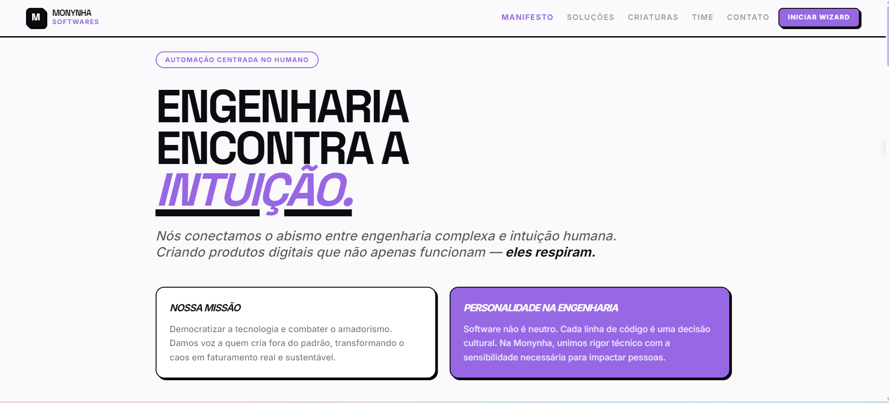
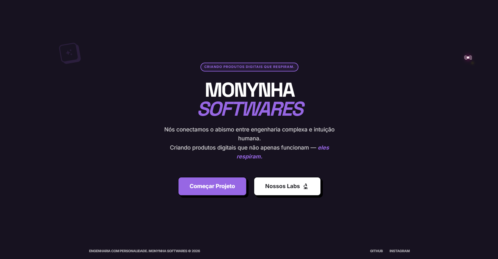
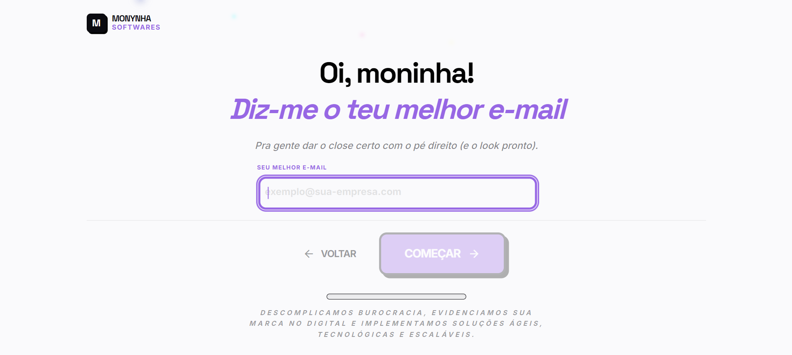

# Monynha Softwares — Lead Generator Form

Wizard de qualificação de leads da Monynha Softwares. O app coleta contexto do lead, gera um diagnóstico de IA via Supabase Edge Functions, persiste os dados no Supabase e dispara e-mails de diagnóstico e confirmação.

## Preview visual

### Homepage (manifesto)



### Intro (tela de abertura)



### Wizard (captura de lead)



### Loading (processamento do diagnóstico)


## O que este projeto faz

- Roda um wizard de 6 etapas para capturar perfil e contexto de negócio do lead.
- Envia imediatamente uma confirmação de contato via `send-contact-confirmation` — garantindo que o lead e o time são notificados mesmo que o diagnóstico falhe.
- Chama a Edge Function `generate-diagnosis` (Gemini + Google Search grounding) para produzir o diagnóstico.
- Persiste lead + diagnóstico via RPC Supabase (`save_lead_with_diagnosis`).
- Dispara e-mails de diagnóstico e notificação interna via `send-diagnostic-email`.
- Exibe o relatório final com pontuações, recomendações e ações de compartilhamento.

## Runtime flow

1. `INTRO` (`IntroScene`) auto-completa em ~3s (ou pode ser pulada).
2. `LANDING` apresenta as CTAs principais.
3. `WIZARD` coleta os dados e armazena rascunho em `localStorage` (`monynha_wizard_draft_v1`).
4. Ao submeter, `App.tsx` muda para `LOADING` e executa:
   - `sendContactConfirmation(data)` — fallback garantido, não bloqueia o fluxo
   - `generateDiagnosis(data)`
   - `Promise.allSettled([saveLead(data, diagnosis), sendDiagnosticEmail(data, diagnosis)])`
5. Após um breve delay, o app transiciona para `REPORT`.
6. Rotas secundárias são controladas por estado: `ABOUT` e `LEGAL`.

## Tech stack

- React 19 + TypeScript + Vite 6
- Tailwind CSS v4 (`@import "tailwindcss"` + `@theme` em `src/styles/index.css`)
- Supabase JS client (`@supabase/supabase-js`)
- Supabase Edge Functions (Deno)
- Gemini via `@google/genai` (dentro da Edge Function)
- Resend (dentro da Edge Function)
- Vitest + Playwright

## Pré-requisitos

- Node.js 20+
- pnpm 10+
- Projeto Supabase (para persistência e functions)
- Supabase CLI (recomendado para dev/deploy local de functions)

## Setup local

```bash
git clone https://github.com/marcelo-m7/Lead-Generator-Form.git
cd Lead-Generator-Form
pnpm install
cp .env.example .env.local
```

Edite `.env.local`:

```bash
VITE_SUPABASE_URL=https://your-project.supabase.co
VITE_SUPABASE_ANON_KEY=your_supabase_anon_key_here
```

Suba o app:

```bash
pnpm dev
```

O servidor de dev sobe em `http://localhost:3000`.

## Secrets do Supabase (obrigatórios no backend)

Configure em Supabase Dashboard → Project Settings → Edge Functions → Secrets:

- `GEMINI_API_KEY`
- `RESEND_API_KEY`
- `RESEND_FROM_EMAIL`
- `MONYNHA_INTERNAL_EMAIL`

Essas chaves são usadas exclusivamente pelas Edge Functions — nunca expostas no `.env` do frontend.

## Scripts

```bash
pnpm dev
pnpm build                    # Gera sitemap antes do build
pnpm preview
pnpm lint
pnpm test
pnpm test:run
pnpm test:coverage
pnpm test:e2e
pnpm ci
pnpm generate:sitemap         # Gera sitemap.xml manualmente
```

`pnpm ci` executa: `pnpm lint && pnpm test:run && pnpm build`.

## Geração de sitemap

O projeto inclui um gerador automático de sitemap que roda antes de cada build:

- **Localização do script**: `scripts/generate-sitemap.js`
- **Saída**: `public/sitemap.xml`
- **URL base**: `https://monynha.com`
- **Geração manual**: `pnpm generate:sitemap`

O sitemap inclui todas as rotas principais:
- `/` (Homepage — prioridade 1.0, atualizações semanais)
- `/about` (Sobre — prioridade 0.8, atualizações mensais)
- `/privacy` (Política de privacidade — prioridade 0.3, atualizações anuais)
- `/terms` (Termos de uso — prioridade 0.3, atualizações anuais)
- `/cookies` (Política de cookies — prioridade 0.3, atualizações anuais)

O sitemap é referenciado automaticamente em `public/robots.txt`.

## Status dos testes

- Testes unitários: todos passando (`tests/unit/types.test.ts`, `tests/unit/supabaseService.test.ts`)
- Testes E2E: specs em `tests/e2e/`, `playwright.config.ts` configurado para `testDir: './tests/e2e'`

## Estrutura do projeto

```text
src/
  App.tsx
  index.tsx
  types/
  services/
    geminiService.ts
    supabaseService.ts
    resendService.ts
    contactConfirmationService.ts
    companySearchService.ts
    index.ts
  components/
  styles/
supabase/functions/
  company-search/
  generate-diagnosis/
  send-contact-confirmation/
  send-diagnostic-email/
tests/
  unit/
  e2e/
```

## Documentação adicional

- `ARCHITECTURE.md`
- `AI_RULES.md`
- `CI_CD_SUMMARY.md`
- `docs/ENVIRONMENT_SETUP.md`
- `docs/EDGE_FUNCTIONS.md`
- `docs/SUPABASE_SETUP.md`
- `docs/SUPABASE_IMPLEMENTATION.md`
- `docs/TESTING.md`

## Atualização recente (a11y/performance)

- Modal de time em `AboutSite` agora usa semântica de diálogo (`role="dialog"`, `aria-modal`, foco inicial no botão fechar e fechamento por `Esc`).
- Avatares remotos em componentes visuais receberam `loading="lazy"` e `decoding="async"` para reduzir custo inicial de renderização.
- Ícone decorativo de seleção no wizard recebeu `aria-hidden="true"` para evitar ruído para leitores de tela.

